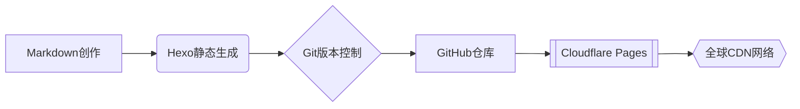

## 🚀 我们是数字时代的造物者

广州市天河外国语学校计算机社成立于2025年，是由学生自主运营的技术实践平台。我们致力于：

- 🔭 **探索前沿技术**：从网络工程到LLM
- 📚 **构建知识体系**：通过技术文档和开源代码沉淀经验

---

## 🧰 技术栈宣言

本博客作为我们的技术试验田，采用现代Web开发最佳实践：

**核心技术组件**：

- **静态生成器**: Hexo 6.3+ (Node.js 18 LTS)
- **部署平台**: Cloudflare Pages (自动SSL/TLS加密)
- **代码托管**: GitHub Organizations (CI/CD集成)
- **性能优化**: Brotli压缩 / 边缘缓存 / HTTP/3优先

---

## 🛠️ 开放协作体系

### 加入我们

- **招新周期**: 全年
- **技能要求**:
  - 基础级：掌握Git工作流
  - 进阶级：具有实际项目开发经验/信息学相关经验
- **申请方式**:
  1. Fork[本仓库](https://github.com/THFLSClub/thfls.club)
  2. 提交PR增加你的个人介绍页
  3. 通过我们代码审查

### 贡献指南

- 文章投稿：遵循[CC BY-NC-SA 4.0](https://creativecommons.org/licenses/by-nc-sa/4.0/)协议
- 代码贡献：符合[Semantic Versioning](https://semver.org/)规范
- 问题反馈：使用[GitHub Issues](https://github.com/THFLSClub/thfls.club/issues)模板

---

## 📡 连接我们

- **代码仓库**: [github.com/THFLSClub](https://github.com/THFLSClub)
- **技术咨询**: <tech@thfls.club> (响应时间<24h)
- **漏洞报告**: [安全响应中心](https://thfls.club/security)
- **社交媒体**:
  
  

---

> 天外计算机社技术委员会 ・ 构建于Cloudflare全球网络